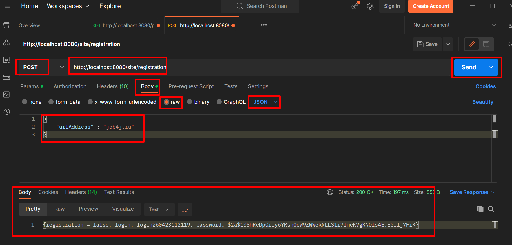
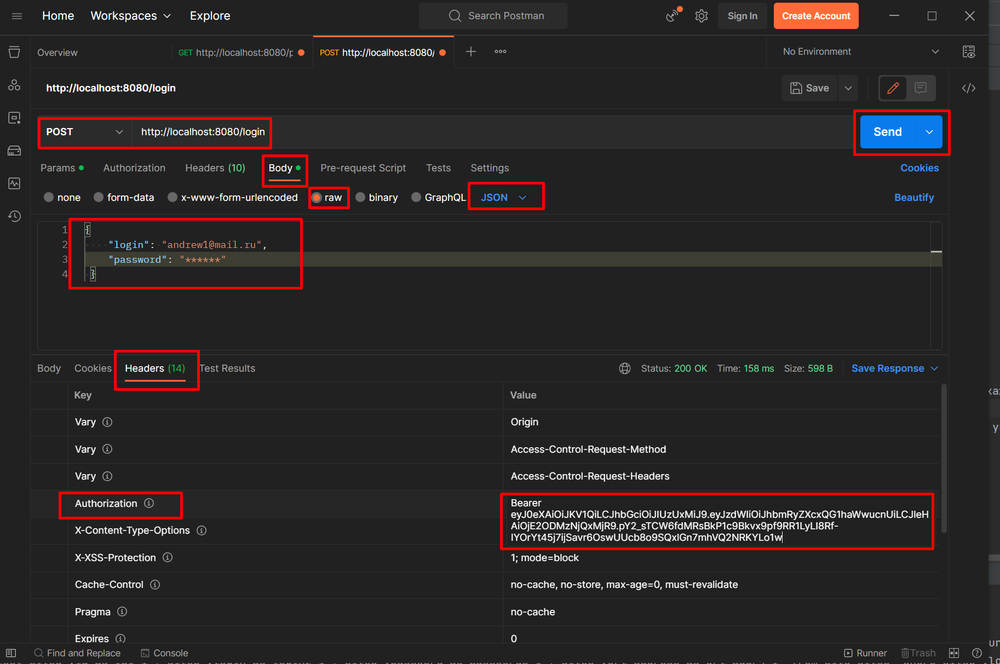
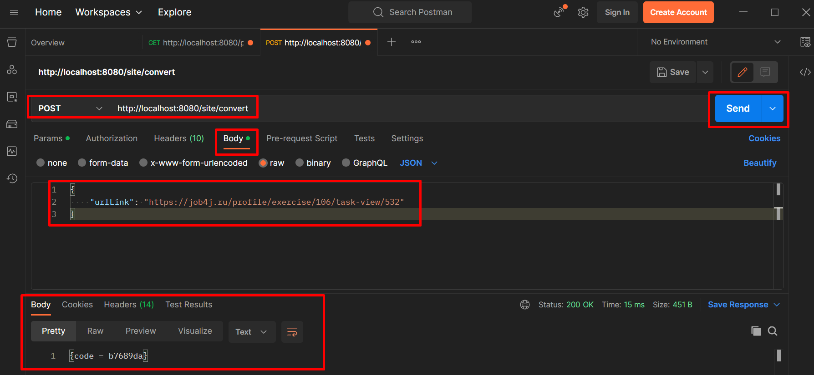
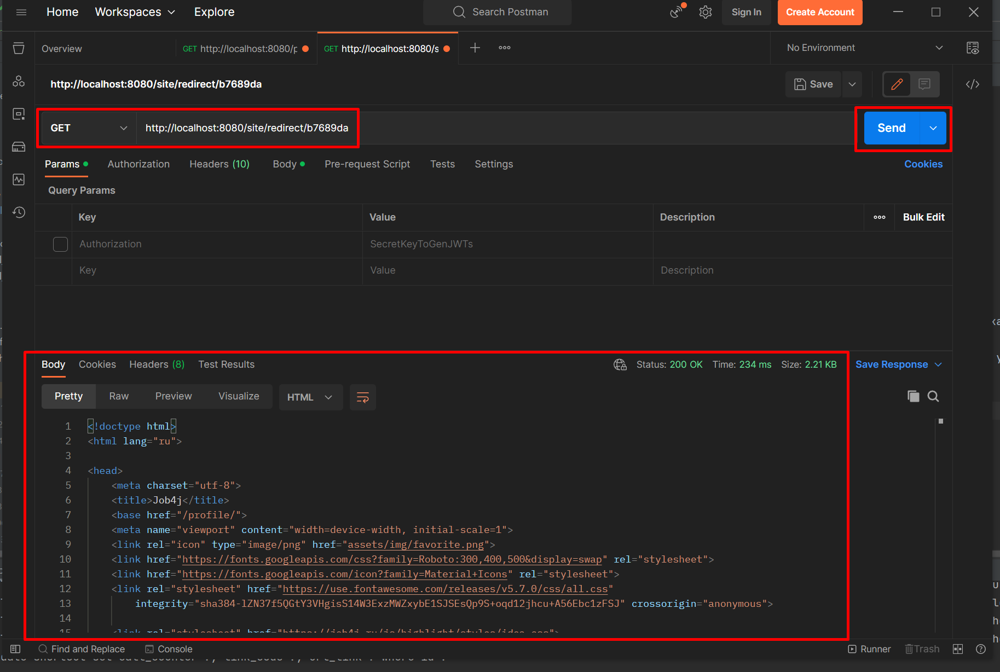
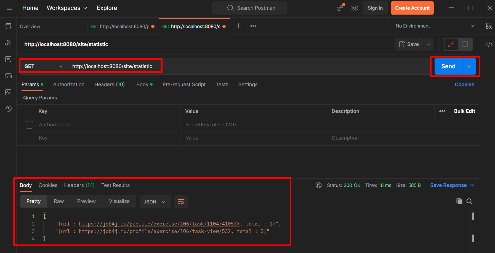

# job4j_url_shortcut
Шифрование ссылок сайтов.

# Описание
Сервис предназначен для регистрации сайта и его страниц. Для безопасности пользователей, все ссылки на страницы сайта заменяются уникальным кодом.
Чтобы получить доступ к странице необходимо указать этот код, будет выполнено перенаправление на страницу. Также сервис позволяет следить за статистикой обращений к страницам сайта.

# Стек технологий
- Java 17;
- PostgreSQL 14;
- Spring Boot 2;
- Hibernate 5;
- Lombok 1;
- Liquibase 4;

# Требования к окружению
- Java 17;
- Maven 3.8;
- PostgreSQL 14.

# Запуск проекта
1. Создать БД: ```url_shortcut```.
2. Запустить приложение из класса Main.
3. Запустить Postman и выполнить запросы.

# Взаимодействие с приложением (в разработке)
1. Зарегистрировать сайт. При регистрации пользователь получит логин и пароль для пользования сервисом.

2. Авторизоваться на сервисе. При авторизации пользователь получит токен, который необходимо будет добавлять в каждый из запросов.

3. Зарегистрировать страницы сайта, которые будут использоваться в работе. При регистрации пользователь получит уникальный ключ, который ассоциирован с зарегистрированной страницей.

4. Проверить работу переадресации, указав уникальный ключ.

5. Получить статистику обращения к страницам сайта.


# Контакты
mymail@gmail.com.